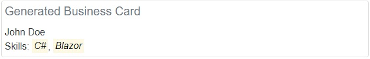

# Phork.Blazor.Reactivity in Action

In this document we will use examples to demonstrate how using `INotifyPropertyChanged`, `INotifyCollectionChanged` combined with the power _Phork.Blazor.Reactivity_ can reduce the amount of boilerplate code we have to write in order to bring reactivity to our components.

You can check out a live demo of the examples described in this document [here](https://phorks.github.io/phork-blazor/reactivity-demo/reactivity-in-action).

Let's assume we have the following models:

```csharp
class Person
{
    public string Name { get; set;}
    public ICollection<Person> Skills { get; }
        = new List<Person>();
}

class PersonSkill
{
    public string Title { get; }
    public bool IsEnabled { get; set; }

    public PersonSkill(string title)
    {
        this.Title = title;
    }
}
```

We want to create a business card generator component that accepts a `Person` parameter. It has two responsibilities, it should let the user edit the person information and it should generate the business card as the user edits the information. Fortunately for us, we already have a fancy `PersonEditor` component that accepts a Person parameter and does the job of letting the user edit the information. So we only have to focus on the business card generation.

You can check out a sample implementation of our fancy person editor component [here](../../samples/ReactivityDemo/Components/PersonEditor.razor). Here is how our fancy person editor component looks:


It simply lets the user change the name, add new skills, and has a checkbox for each added skill to enable or disable it. Our generated business card should show the name at the first line and show all the __enabled__ skills at the second line. For instance for the information present in the above picture, the business card should look like this:



The key point here is that there is no generate button. When the user changes the name in the input box, the name in the business card should change instantly. When a new skill is added by the person-editor component, generated business card should include it right away and checking/unchecking the enabled checkbox should immediately show/hide the respective skill in the business card.

To demonstrate that Blazor bindings are not capable of reacting to the changes in our scenario, here is a sample implementation of the business card generator component:

```html
<h3>Business Card Generator</h3>

<PersonEditor Person="Person" />

<div class="card" style="padding:5px">
    <h5 class="card-title text-secondary">Generated Business Card</h5>
    <div class="card-text">
        @(Person.Name) <br />
        Skills:
        @foreach (var skill in Person.Skills)
        {
            if (skill.IsEnabled)
            {
                <span @key="skill">
                    <mark><i>@(skill.Title)</i>
                    </mark>
                    @(skill == Person.Skills.Last(x => x.IsEnabled) ? "" : ", ")
                </span>
            }
        }
    </div>
</div>

@code {
    [Parameter] public Person Person { get; set; }
}
```

This way we would not get our desired result. Neither changing the name, nor adding a skill, nor changing the enabled state of a skill make any changes to the generated business card!

The first solution that comes to mind is to modify our person editor component to let our main component know whenever it modifies the person. But as mentioned above, this component is a reusable component that is possibly being used somewhere else. Even if it wasn't, it is not usually a good practice to let components know about each other as it makes our components tightly-coupled. So modifying the editor component is out of the question.

The best solution to detect changes in the models is to let them notify their changes. The common approach in C# to achieve this is by implementing `INotifyPropertyChanged` and `INotifyCollectionChanged` interfaces. A class  implementing `INotifyPropertyChanged` has a `PropertyChanged` event that will be raised whenever a property of the object is changed. Collections implmeneting `INotifyCollectionChanged` have a `CollectionChanged` event that will be raised whenever a modification is done to the collection. You will not often implement `INotifyCollectionChanged` yourself as there is already `ObservableCollection<T>` that acts like a `List<T>` and implements `INotifyCollectionChanged`.

Here is the modified version our models:

```csharp
class Person : INotifyPropertyChanged
{
    private string _name;
    public string Name
    {
        get => this._name;
        set
        {
            if (value == this._name)
                return;

            this._name = value;
            this.PropertyChanged?.Invoke(this, new PropertyChangedEventArgs(nameof(this.Name)));
        }
    }

    private ObservableCollection<PersonSkill> _skills
        = new ObservableCollection<PersonSkill>();

    public ObservableCollection<PersonSkill> Skills
    {
        get => this._skills;
        set
        {
            if (value == this._skills)
                return;

            this._skills = value;
            this.PropertyChanged?.Invoke(this, new PropertyChangedEventArgs(nameof(this.Skills)));
        }
    }

    public event PropertyChangedEventHandler PropertyChanged;
}

class PersonSkill : INotifyPropertyChanged
{
    public string Title { get; }

    private bool _isEnabled = true;
    public bool IsEnabled
    {
        get => this._isEnabled;
        set
        {
            if (value == this._isEnabled)
                return;

            this._isEnabled = value;
            this.PropertyChanged?.Invoke(this, new PropertyChangedEventArgs(nameof(this.IsEnabled)));
        }
    }

    public PersonSkill(string title)
    {
        this.Title = title;
    }

    public event PropertyChangedEventHandler PropertyChanged;
}
```

Now that our models are capable of notifying their changes, we should change our component to react to these changes. These steps have to be done in order to get the desired results in our business card generator:

1. Listen to the `PropertyChanged` event of `Person` parameter. If the property being changed is `Name` or `Skills` re-render the component.
2. Listen to the `CollectionChanged` event of `Skills`. A re-render is required if the collection gets modified.
3. For each skill in `Skills` parameter, we must listen to its PropertyChanged and re-render the component if the property being changed is `IsEnabled`.

We can do these in the `OnInitialized` method of our component:

```csharp
protected override void OnInitialized()
{
    base.OnInitialized();

    this.Person.PropertyChanged += (_, e) =>
    {
        if (e.PropertyName == nameof(Person.Name) || e.PropertyName == nameof(Person.Skills))
            this.StateHasChanged();
    };

    PropertyChangedEventHandler skillChanged = (_, e) =>
    {
        if (e.PropertyName == nameof(PersonSkill.IsEnabled))
            this.StateHasChanged();
    };

    this.Person.Skills.CollectionChanged += (_, e) =>
    {
        if (e.Action == System.Collections.Specialized.NotifyCollectionChangedAction.Move)
            return;

        if (e.OldItems != null)
        {
            foreach (var item in e.OldItems)
            {
                (item as PersonSkill).PropertyChanged -= skillChanged;
            }
        }

        if (e.NewItems != null)
        {
            foreach (var item in e.NewItems)
            {
                (item as PersonSkill).PropertyChanged += skillChanged;
            }
        }

        this.StateHasChanged();
    };
}
```

By doing so our component will work as expected but there are some problems:

* What if the parent of our component decides to change the `Person` parameter of our component? We have to unsubscribe the `PropertyChanged` event of the old one and subscribe to the event of the new one.

* What if the `Name` property was not a direct property of `Person` class? For example let's suppose it was `Person.Identification.Name` and both `Person` and `Identification` implemented `INotifyPropertyChanged`. In this case, we had to subscribe the `PropertyChanged` event of `Person` and wait for the changes to `Identification`. And when that happens we would have to unsubscribe the old `Identification` and listen to the new one for changes to `Name`. What if the `INotifyPropertyChanged` chain was longer?

* And too many what-ifs and edge cases that we have to consider.

Here is where _observed values_ come to the rescue.

Instead of manually handling all `PropertyChanged` and `CollectionChanged` events, we can simply make our component inherit from `ReactiveComponentBase` and use `Observed(() => Path.To.Property)` syntax whenever we need reactivity. Applying this to our business card generator component will make it look like this:

```html
@inherits ReactiveComponentBase

<h3>Business Card Generator</h3>

<PersonEditor Person="Person" />

<div class="card" style="padding:5px">
    <h5 class="card-title text-secondary">Generated Business Card</h5>
    <div class="card-text">
        @Observed(() => Person.Name) <br />
        Skills:
        @foreach (var skill in Observed(() => Person.Skills))
        {
            if (Observed(() => skill.IsEnabled))
            {
                <span @key="skill">
                    <mark><i>@(skill.Title)</i></mark>
                    @(skill == Person.Skills.Last(x => x.IsEnabled) ? "" : ", ")
                <span>
            }
        }
    </div>
</div>

@code {
    [Parameter] public Person Person { get; set; }
}
```

And everything works as expected!

## Observed Bindings

For the sake of demonstration let's use our `Person` model again. This time we want to create a `PersonNameEditor` component that accepts a `Person` parameter and has an input textbox allowing the user to change the name of the person. But our component should be aware that the name property can be modified by an external code anytime and should be able to reflect the external changes immediately. For simplicity, here the external code that is going to modify the name is another instance of our component! Now the problem comes down to designing the `PersonNameEditor` in a way that if we create two instances of it sharing the same person parameter, their text inputs will get synchronized. A simple usage of our component should be like this:

```html
<PersonNameEditor Person="person" />
<PersonNameEditor Person="person" />

@code {
    private Person person = new Person();
}
```

Without _Phork.Blazor.Reactivity_ we can implement `PersonNameEditor` as follows:

```html
<h3>Person name editor</h3>

<div>
    <label>Name <input class="form-control" type="text" @bind="Person.Name" @bind:event="oninput" /></label>
</div>

@code {
    [Parameter] public Person Person { get; set; }
}
```

This way the text inputs won't be synchronized, as the components will not re-render when the `Name` property of their person parameters change. Replacing `@bind="Person.Name"` by `@bind="Binding(() => Person.Name).Value"` (and adding `@inehrits ReactiveComponentBase` to the start of the file of course!) will solve the problem. It not only re-renders the component when `Person.Name` is changed -by subscribing to `Person.PropertyChanged` and waiting for changes to `Name` property just like `Observed(() => Person.Name)`- but also as `Binding(() => Person.Name).Value` is considered to be a variable -as opposed to `Observed(() => Person.Name)`- it can perfectly be the left-hand side of an assignment.

Modified version of the component that inherits from `ReactiveComponentBase` and uses _Observed Bindings_:

```html
@inherits ReactiveComponentBase

<h3>Person name editor</h3>

<div>
    <label>Name <input class="form-control" type="text" @bind="Binding(() => Person.Name).Value" @bind:event="oninput" /></label>
</div>

@code {
    [Parameter] public Person Person { get; set; }
}
```

In this example we used _Observed Bindings_ to bind `Person.Name` to the value of the text input. Here both the source and the target have the same string type. However, _Observed Values_ can be used if the source and the target have different types.

### _Observed Bindings_ with Converters

Let's modify our scenario. Now our page should contain two components. The first component is going to be the same `PersonNameEditor` that we used in the previous section. The second component is going to be a `MakeAdmin` component that accepts a `Person` parameter and has a '_is admin_' checkbox. When the user checks the checkbox, it will store the current value of `Person.Name` and then change it to 'admin'. When the user unchecks the checkbox, the component will revert `Person.Name` to the stored value. On the other hand, our `MakeAdmin` component is aware that `Person.Name` can be changed externally -by our `PersonNameEditor` component for instance. Whenever `Person.Name` changes, `MakeAdmin` checks to see if the new value is 'admin' if it is, its '_is admin_' is gonna be checked and vice versa.

You can try to implement `MakeAdmin` component without _Observed Bindings_ if you want to. Here is the implementation using _Observed Bindings_:

```html
@inherits ReactiveComponentBase

<h3>Make Admin Component</h3>

<input type="checkbox" @bind="Binding(() => Person.Name, GetIsAdmin, GetName).Value" />

@code {
    private string storedName = string.Empty;

    [Parameter]
    public Person Person { get; set; }

    private bool GetIsAdmin(string name)
        => name == "admin";

    private string GetName(bool isAdmin)
    {
        if (isAdmin)
        {
            this.storedName = this.Person.Name;
            return "admin";
        }
        return this.storedName;
    }
}
```

Whenever `Person.Name` gets a new value, the value will be passed to `GetIsAdmin` and it will return a boolean value. Then the boolean value will be set to the value parameter of the checkbox. And when the value parameter of the checkbox gets changed the new value will be passed to `GetName` and the result will be set to `Person.Name`. As simple as that!
